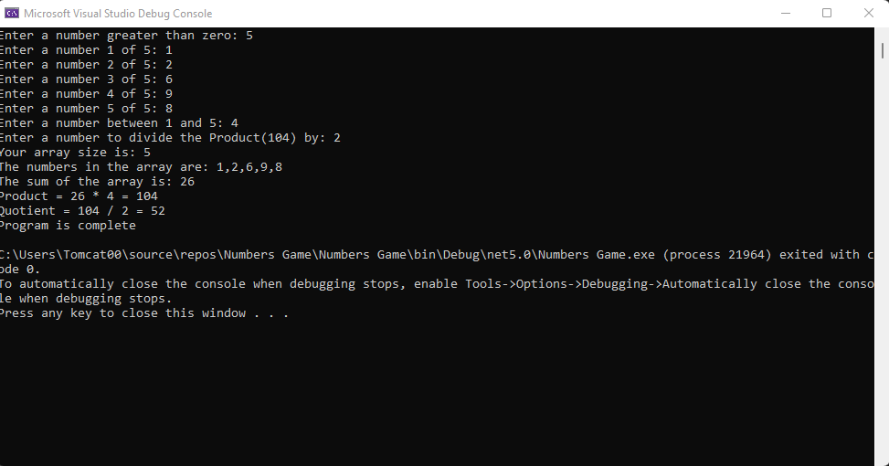

# Lab01-a
## Ahmad Masadeh
# Numbers Game
You need to create a .Net Console Application then copy the code from Program.cs and past it in your Program.cs file
 
The purpose of the program to run a Number Game Application

run the program on visual studio 
  1. Enter the size of the array
  2. Enter the array Contant 
  3. Enter a number to multiply the sum of the array by
  4. Enter a number to divide the Product by 

## This the Program

